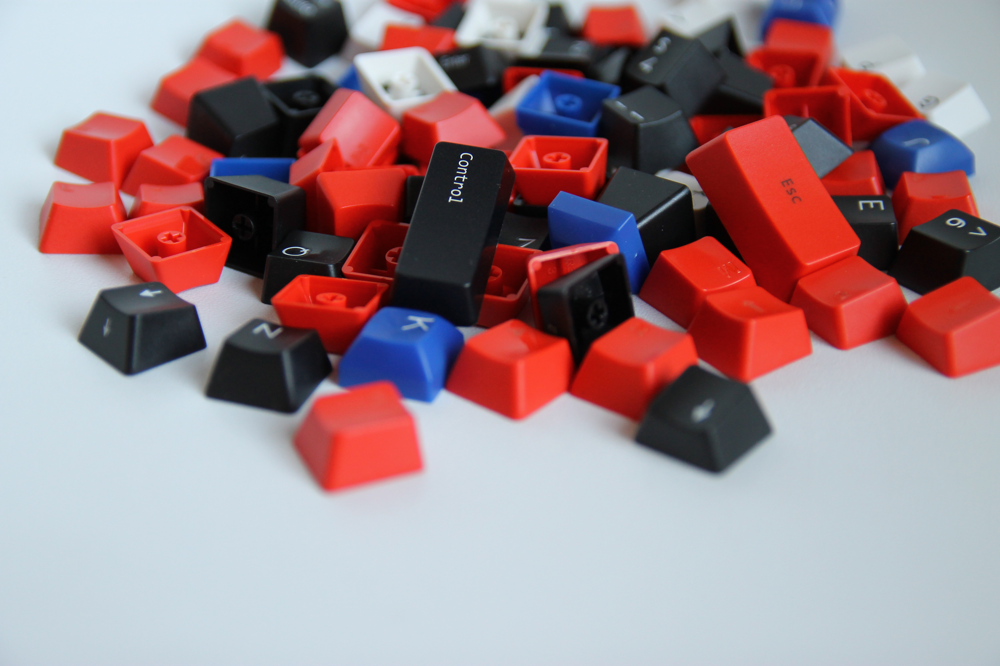

# Click, Clack, Code: Mechanical Keyboards and You

---

# [fit] I :heart: my keyboard

^ Hi everybody. Tonight I'd like to talk about my keyboard

---

# This is our story

^ and tell you our story. :)

---

# been typing for
# [fit] 20 years

^ - When I started at Gilt in 2011 ...

^ - typing for about 20 years

---

# at age 33, my wrist started hurting

^ about a year later my wrist started hurting

---

# [fit] Hazards of the trade
### Repetitive Strain Injury
### vs
### Carpal Tunnel Syndrome

^ - If, like me, you type for a living

^ - our trade isn't without hazards.

^ - common career-ending injuries amoungst programmers are RSI and Carpal Tunnel

---

# RSI
### you do something over and over until it hurts

^ - You get RSI from performing a single action repeatedly. Like pushing buttons.

^ - The best defense is taking breaks, stretching and excercise. 

^ - PSA to Emacs users, in preparing for this talk I found a strong correlation between Emacs and RSI (google it Bryan)

---

# Carpal Tunnel

^ Carpel Tunnel happens because of strain to the tendons in your wrists.

---

^ amongst typist this happens when you type with bent wrists

--- 

# [fit] Not a doctor

^ Just a note, I'm not a doctor. So while it's good to be aware of these things, if you're in pain, please seek medical attention

---

# So I tried a kinesis

^ Being at Gilt

^ immersed in Kinesis culture

^ gave it a try

---

# it looks like this

^ which looks intimidating, and I won't lie, there is an adjustment period

---

# The struggle was real

^ - Between the concave key "pits", the distance of the split, and the thumb keys it took some getting used to.

^ - 3 days to get back to 80%, 3 months to get to 100%

---

# Instant Advantages

* Key remapping
* Thumb Keys
* Satisfying click
* My wrist stopped hurting

^ but once I got over the initial shock there were some "kinesis advantages". 

--- 

# Key remapping

^ - The Kinesis has the ability to change layout or remap individual keys

^ - being a vim user, I made some adjustments up front that 
I've stuck with for the past 3 years.

^ - Caps Lock -> Ctrl, Del -> ESC, and I switched the arrows -> j and k

---

# Thumb Keys

^ - perhaps the biggest adjustment

^ - quickly appearant how under-utilized my thumbs had been

^ - Keyboard shortcuts got a lot more comfortable

---

# I was hooked

^ - Once the Kinesis started to feel "natural" I was hooked.

^ - Typing was comfortable and actually more fun.

---

### The Kinesis is a 
# "mechanical keyboard"
 
^ - Once we became besties, I wanted to learn more about my new friend.
^ - The kinesis is a mechanical keyboard. That means there is a separate complete switches underneath every key.

---

# Cherry

Cherry MX. They are made in Germany.

^ The most popular switch manufactuer is Cherry from Germany. Their most popular product is the Cherry MX key switch
 
---

## I started with tactile switches

Give you a tactile bump on activation

^ My first Kinesis had Cherry browns. They give you a little "bump" when the key is activated

---

## Then I switched to linear switches

Cherry Linear switches have a consistent force through out the key press.

^ - After some experimentation I landed on the linear cherry reds

^ - They take less force to activate, but don't give any feedback.

^ - somewhat controversial amongst enthusiests since the "bump" keeps you from bottoming out

---

## Clicky switches

These tend to be some of the loudest of the Cherry switches.

^ - Which is why Cherry introduced their "clicky" switches

^ - more "bump" 

^ - louder, so everyone can tell how productive you are

---

# Just the beginning

^ this was only the beginning of my journey

---

^ just like laptop stickers

---

^ or a custom terminal prompt

---

^ you can trick out your keyboard

---

^ with keycaps

---

^ backlit keyswitches

---

^ ergonomic layouts

---

# Learn More

* geekhack.org/
* deskthority.net/
* reddit.com/r/mechanicalkeyboards
* keychatter.com/

^ Here are some places I've found good information

---

# Go Shopping

* massdrop.com/mechanical-keyboards
* mechanicalkeyboards.com/shop/
* wasdkeyboards.com
* amazon.com or whatever

^ - There aren't a lot of places in New York to find this stuff

^ Here are some places that have the most popular keyboards available

---

# I love my keyboard.

^ To sum up, I love my keyboard

---

# you should love you keyboard too.

^ and I think you should love your keyboard too. You use it everyday and probably will for years to come

---
 
# We have samples
 
^ I have my keyboard with me and our man Hayden has brought some key switch samples, so if you want to try some stuff out. Come and see us during Beverage time.js

---
 

# [fit] I'm on the Internet

- nathanstilwell.com
- @nathanstilwell
- www.google.com/#q=nathan+stilwell

^ Thanks for listening. You can find me on the Internet

---

# [fit] 谢谢
