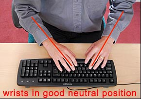

# Click, Clack, Code: Mechanical Keyboards and You

---

# [fit] Hi,
*I'm Nathan Stilwell*


---

# [fit] I really
# [fit] :heart: my keyboard

---


# This is our story

---


# [fit] This is my
# [fit] right wrist

The broken part is my
*Scaphoid*

---


# [fit] This is a
# [fit] good
# [fit] Scaphoid

---


---


# [fit] My first day at Gilt
Notice the keyboard

---


---


# I had been typing for
# [fit] 20 years
# at this point

---


had a lot of Kinesis fans. Here are a few.

   

---

# Eventually,
# wrist pain

---

# Wrist Health
## RSI
*R*epetitive *S*train *I*njury

*you do something over and over until it hurts*

---


# Carpal Tunnel
burning out your flexor tendons

---




--- 


# Remember, you type for a living

--- 

# Key mapping

`caps lock` -> `control`
`del` -> `esc`

---

# Key layout

Some people on the Internet have reported less pain when using Dvorak. 


Other popular options are Colemak and Workman

---

# Keyboard Shortcuts
## I dig 'em

from my Slate config

```
#move in monitor
bind up:cmd,ctrl,shift ${full}
bind left:cmd,ctrl ${lefthalf}
bind right:cmd,ctrl ${righthalf}

# Window Hints
bind e:cmd,alt hint hjklyuiopnm

# Apps
bind t:cmd,alt,ctrl focus ${terminal}
bind e:cmd,alt,ctrl focus ${editor}
bind s:cmd,alt,ctrl focus ${spotify}
bind b:cmd,alt,ctrl focus ${devbrowser}
bind l:cmd,alt,ctrl focus ${slack}
bind x:cmd,alt,ctrl focus ${xcode}
```

---

Then I switched from Cherry Browns to Cherry Reds

---

^ I wanted to change my "delete" key to an "escape" key

- Keycaps
- Types
- Fun!

---

^ The joy of investing in my keyboard

---

^ Go and find your own keyboard

---

# [fit] I'm
# [fit] Nathan Stilwell

*available on the Internet*

- nathanstilwell.com
- @nathanstilwell
- https://www.google.com/#q=nathan+stilwell

---

# [fit] STOP


# Do you put stickers on your laptop?

Probably because you're **invested in your gear**.

---

# [fit] So let's talk
# [fit] about your
# [fit] keyboard

---

# What's a keyboard?

> device which uses an arrangement of buttons or keys to act as mechanical levers or electronic switches.

*facinating, thanks Wikipedia*

---

# Also worth noting

> Following the decline of punch cards and paper tape, interaction via teleprinter-style keyboards became the main input device for computers

So this talk is **pretty relavant**

---

# [fit] So what should you think about
# [fit] in your keyboard technology?

---

# How does it feel?

- key response (feed back that the key has been pressed)
- travel (the distance needed to press a key)
- actuation force (the force required to activate the key)

---

# Does it help me do my job?
- KRO (*Key Roll Over*, how many keys can you press at once?)\*
- Ergonomic benefit (is it good for my hands and wrists?)
- Programability (can re-map keys? do I get macros?)
- Layout (Qwerty, Dvorak, Colemak, Workman)

---

# How much fun am I having?
- Backlighting
- Key Caps
- How does it sound?
- does it look awesome?

You should *enjoy* your tools.

---

# Keyboards get broken up into categories by thier switches

Today we're going to focus on the *mechanical* kind (it's my favorite)

---

## What's a mechanical keyboard?

> Mechanical-switch keyboards use separate complete switches underneath every key.

---

# Cherry

> Cherry is the maker for (*probably*) the most popular key switch out there, the Cherry MX. They are made in Germany.


---

## Cherry MX "flavors"
### Tactile switches


Cherry Tactile switches give you a tactile bump on activation, the most popular are the Cherry "Browns".

They have three tactile switches that activate at different pressures.

- Brown (50g)
- Clear (70g)
- Light Gray (80g)

---

## Cherry MX "flavors"
### Linear switches


Cherry Linear switches have a consistent force through out the key press. Popular among gamers because they are "fast".

Again, three flavors

- Red (45g)
- Black (60g)
- Dark Gray (80g)

---

## Cherry MX "flavors"
### Clicky switches


Cherry tactile "click" switches give tactile feed back with a satisfying click on activation. These tend to be some of the loudest of the Cherry switches.

Here's three more

- Blue (55g)
- Green (80g)
- White (85g)

---

